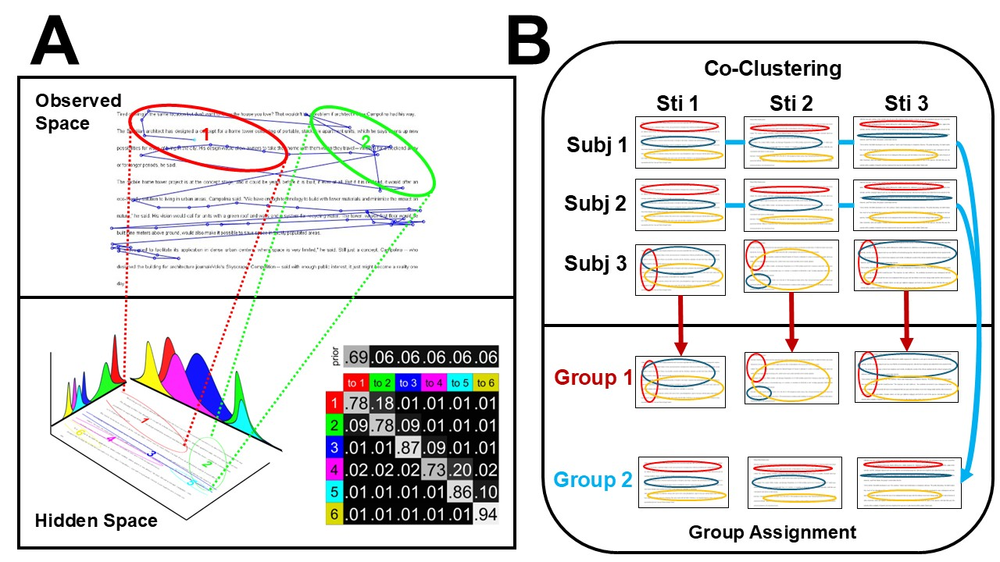

# Emotion influences behavioral outcomes and attention during goal-directed reading

Code and data for **Emotion influences behavioral outcomes and attention during goal-directed reading** 

**E, Wang, Y Zheng JH Hsiao, U Maurer, (2025). Emotion influence comprehension in goal-directed reading through Attention.** *PsyArXiv*  

___

 
___
## **Abstract**
Recent studies on the interaction between emotion and reading comprehension provide a murky picture with contradictory claims. Here, we offer one explanation for this phenomenon. By utilizing an advanced eye movement analysis method EMHMM with co-clustering, we discovered two representative attention patterns from eye fixations: an expanded, globalized attentional pattern and a more focused, localized attentional pattern. The subsequent analysis shows that these two attention patterns were differentially associated with comprehension accuracy in questions that required either globalized (summative questions) or localized (detailed questions) attentional needs. Moreover, the emotional state influenced the use of the two attentional strategies, as well as reading performance, measured as accuracy and reading time. Our findings demonstrate how emotion may have facilitated or interfered with cognitive processing during reading comprehension that requires different attentional needs, which provides valuable insight into the intertwining relationship between emotions and other cognitive functions.

___
## **Introduction**
This repository includes code to replicate the analysis and produce figures in the paper. In short, our analysis includes 2 parts.

* HMM modelling with co-clustering on Eye fixations (see [**This paper**](https://link.springer.com/article/10.3758/s13428-021-01541-5) for more detail)
* Behavioural (reading) analysis along with HMM Results

* To replicate the HMM model, go to [HMM_model](HMM_model/), and run [Model_fitting.m](HMM_model/Model_fitting.m).
___

For bug reports, please contact [Eric Wang](mailto:eric.wang2004nz@link.cuhk.edu.hk)
